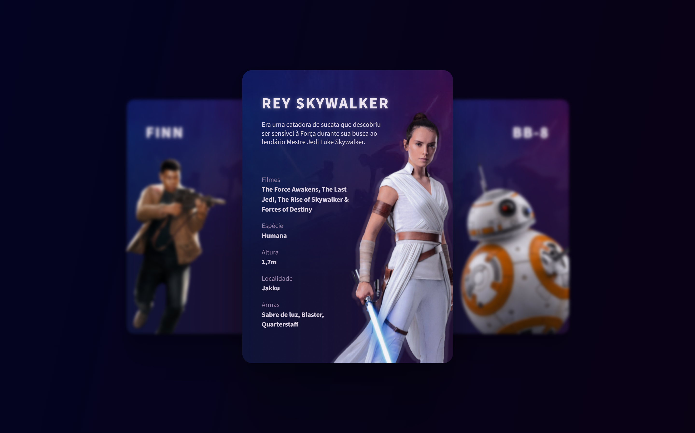

<h1 align="center"> Starwars: Personagens - BoraCodar#18 </h1>

[Clique aqui para acessar](https://maik-emanoel.github.io/starwars-characters/)

## 🚀 Tecnologias

Esse projeto foi desenvolvido com as seguintes tecnologias:

- HTML
- CSS
- JavaScript
- Git and GitHub

## 💻 Projeto

O Starwars: Personagens é um projeto que utiliza cards para mostrar habilidades/características de alguns dos personagens da franquia Star Wars. 

Projeto construído a partir do layout proposto no desafio [#BoraCodar18](https://boracodar.dev/) realizado pela [Rocketseat](https://rocketseat.com.br).
Após o desenvolvimento do projeto inicial, adicionei novas features, tais quais:

- Layout responsivo (Adaptado para telas menores);
- Alteração do layout original;
- Animações/efeitos hover;
- Entre outras pequenas modificações.

## 🔖 Layout

Você pode visualizar o layout do projeto proposto através [DESSE LINK](https://www.figma.com/community/file/1235589928611910732). É necessário ter conta no [Figma](https://figma.com) para acessá-lo.